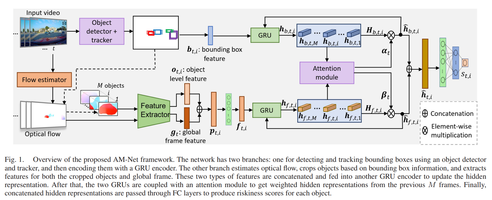

# AM-Net



## 1. Introduction

<!-- [ALGORITHM] -->

```BibTeX
@article{karim2023attention,
  title={An Attention-guided Multistream Feature Fusion Network for Early Localization of Risky Traffic Agents in Driving Videos},
  author={Karim, Muhammad Monjurul and Yin, Zhaozheng and Qin, Ruwen},
  journal={IEEE Transactions on Intelligent Vehicles},
  year={2023},
  publisher={IEEE}
}
```

## 2. To train, test and demo the model for the ROL dataset, run the following scripts:
```shell
bash scripts/train_rol.sh
bash scripts/test_rol.sh
bash scripts/demo_rol.sh
```

## 3. To train, test and demo the model for the DOTA dataset, run the following scripts:
```shell
bash scripts/train_dota.sh
bash scripts/demo_dota.sh
bash scripts/test_dota.sh
```

## 4. Acknowledgement
* [monjurulkarim/risky_object](https://github.com/monjurulkarim/risky_object)
