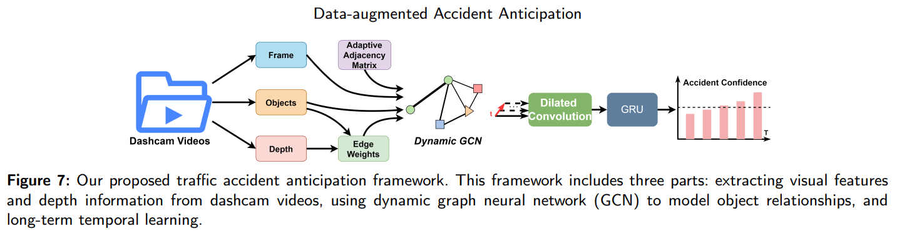

# AOTA



## 1. Introduction

<!-- [ALGORITHM] -->

```BibTeX
@article{guan2025world,
  title={World model-based end-to-end scene generation for accident anticipation in autonomous driving},
  author={Guan, Yanchen and Liao, Haicheng and Wang, Chengyue and Liu, Xingcheng and Zhang, Jiaxun and Li, Zhenning},
  journal={Communications Engineering},
  volume={4},
  number={1},
  pages={144},
  year={2025},
  publisher={Nature Publishing Group UK London}
}
```

## 2. To process the dataset, run the following script:
```shell
bash scripts/process_dataset.sh
```

## 3. To train and test the model, run the following script:
```shell
bash scripts/train.sh
```

## 4. Acknowledgement
* [humanlabmembers/Anticipation-of-Traffic-Accident](https://github.com/humanlabmembers/Anticipation-of-Traffic-Accident)
