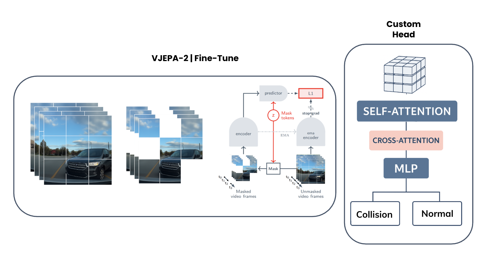

# BADAS



## 1. Introduction

<!-- [ALGORITHM] -->

```BibTeX
@article{goldshmidt2025badas,
  title={BADAS: Context-Aware Collision Prediction Using Real-World Dashcam Data},
  author={Goldshmidt, Roni and Scott, Hamish and Niccolini, Lorenzo and 
          Zhu, Shizhan and Moura, Daniel and Zvitia, Orly},
  journal={arXiv preprint arXiv:2025.xxxxx},
  year={2025}
}
```

## 2. To test the model for a video, run the following script:
```shell
bash scripts/test.sh
```

## 3. Acknowledgement
* [getnexar/BADAS-Open](https://github.com/getnexar/BADAS-Open)
