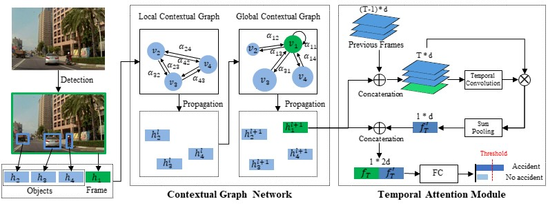

# CGNAM



## 1. To install the environment, run the following script:
```shell
bash scripts/install.sh
```

## 2. To process the dataset, run the following script:
```shell
bash scripts/process_dataset.sh
```

## 3. To train and test the model, run the following script:
```shell
bash scripts/train.sh
```

## 4. Acknowledgement
* [CGNAM/CGNAM](https://github.com/CGNAM/CGNAM)
