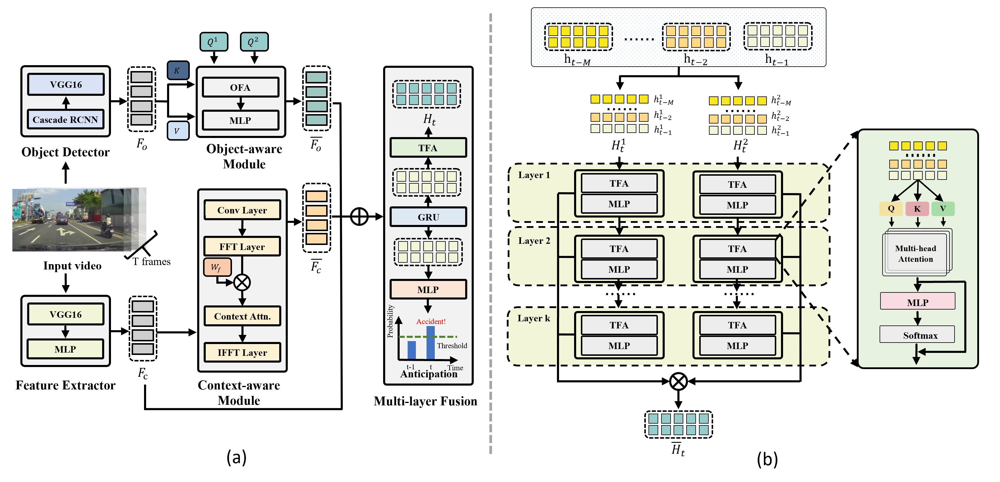

# CRASH



## 1. Introduction

<!-- [ALGORITHM] -->

```BibTeX
@inproceedings{liao2024crash,
  title={Crash: Crash recognition and anticipation system harnessing with context-aware and temporal focus attentions},
  author={Liao, Haicheng and Sun, Haoyu and Shen, Huanming and Wang, Chengyue and Tian, Chunlin and Tam, KaHou and Li, Li and Xu, Chengzhong and Li, Zhenning},
  booktitle={Proceedings of the 32nd ACM International Conference on Multimedia},
  pages={11041--11050},
  year={2024}
}
```

## 2. To install the environment, run the following script:
```shell
bash scripts/install.sh
```

## 3. To process the dataset, run the following script:
```shell
bash scripts/process_dataset.sh
```

## 4. To train and test the model for the DAD dataset, run the following scripts:
```shell
bash scripts/train_dad.sh
bash scripts/testr_dad.sh
```

## 5. Acknowledgement
* [Petrichor625/CRASH](https://github.com/Petrichor625/CRASH)
