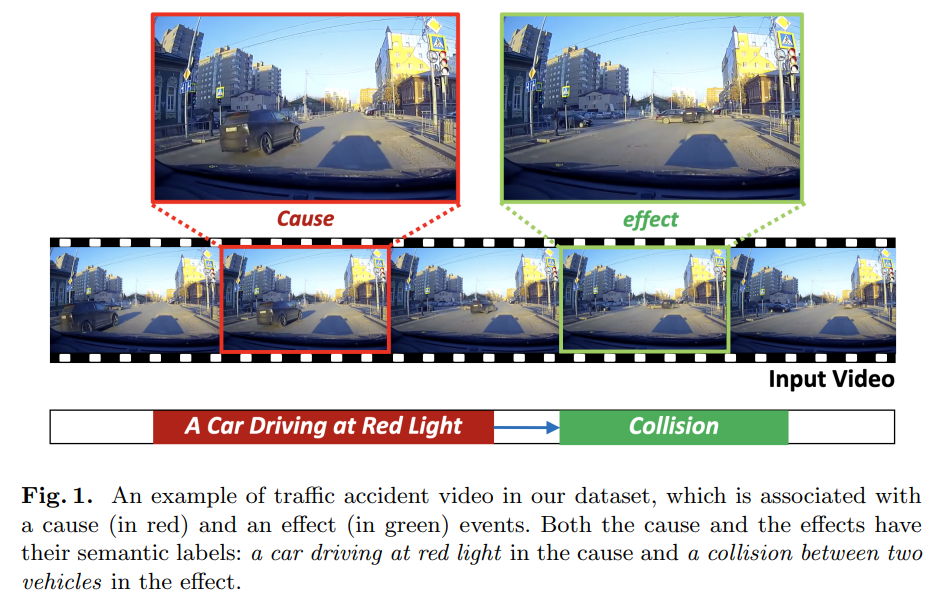

# CTA



## 1. Introduction

<!-- [ALGORITHM] -->

```BibTeX
@inproceedings{you2020CTA,
    title     = "{Traffic Accident Benchmark for Causality Recognition}",
    author    = {You, Tackgeun and Han, Bohyung},
    booktitle = {ECCV},
    year      = {2020}
}
```

## 2. To train and test the model for the CTA dataset, run the following script:
```shell
bash scripts/train.sh
```

## 3. Acknowledgement
* [tackgeun/CausalityInTrafficAccident](https://github.com/tackgeun/CausalityInTrafficAccident)
