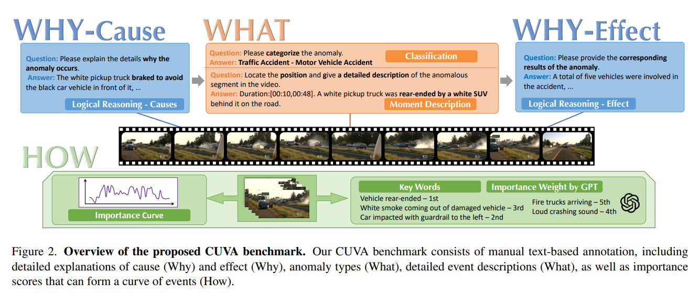

# CUVA



## 1. Introduction

<!-- [ALGORITHM] -->

```BibTeX
@INPROCEEDINGS{CUVA,
  author={Du, Hang and Zhang, Sicheng and Xie, Binzhu and Nan, Guoshun and Zhang, Jiayang and Xu, Junrui and Liu, Hangyu and Leng, Sicong and Liu, Jiangming and Fan, Hehe and Huang, Dajiu and Feng, Jing and Chen, Linli and Zhang, Can and Li, Xuhuan and Zhang, Hao and Chen, Jianhang and Cui, Qimei and Tao, Xiaofeng},
  booktitle={2024 IEEE/CVF Conference on Computer Vision and Pattern Recognition (CVPR)}, 
  title={Uncovering what, why and How: A Comprehensive Benchmark for Causation Understanding of Video Anomaly}, 
  year={2024},
  volume={},
  number={},
  pages={18793-18803},
  keywords={Measurement;Annotations;Surveillance;Natural languages;Benchmark testing;Traffic control;Pattern recognition;Anomaly Video;Large Language Model},
  doi={10.1109/CVPR52733.2024.01778}
}
```

## 2. To install the environment, run the following script:
```shell
bash scripts/install.sh
```

## 3. To download the dataset, run the following script:
```shell
bash scripts/download_dataset.sh
```

## 4. To download pretrained weights, run the following script:
```shell
bash scripts/download_weights.sh
```

## 5. To test the model for a video, run the following script:
```shell
bash scripts/test.sh
```

## 6. Acknowledgement
* [fesvhtr/CUVA](https://github.com/fesvhtr/CUVA)
