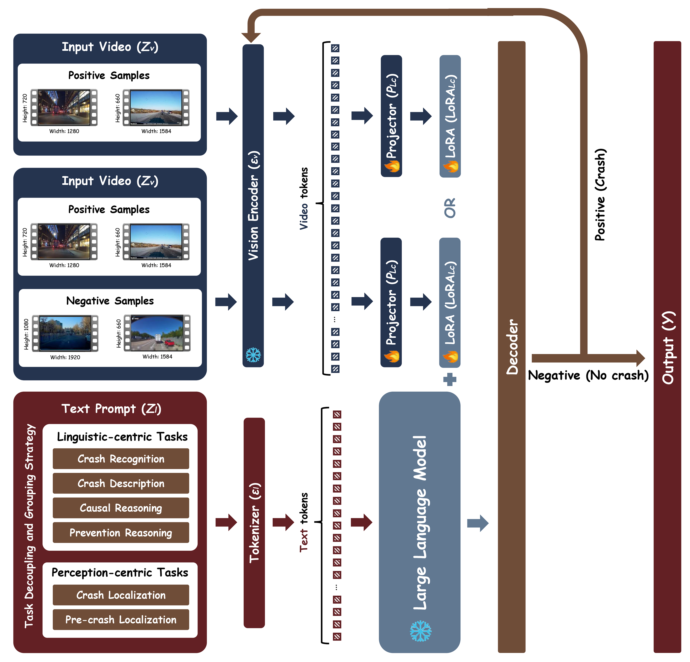

# CrashChat



## 1. Introduction

<!-- [ALGORITHM] -->

```BibTeX
@article{liang2025crashchat,
  title   = {CrashChat: A Multimodal Large Language Model for Multitask Traffic Crash Video Analysis},
  author  = {Liang, Kaidi and Li, Ke and Hu, Xianbiao and Qin, Ruwen},
  journal = {arXiv preprint arXiv:2512.18878},
  year    = {2025},
  archivePrefix = {arXiv},
  eprint  = {2512.18878},
  primaryClass = {cs.CV},
  url     = {https://arxiv.org/abs/2512.18878}
}
```

## 2. To install the environment, run the following script:
```shell
bash scripts/install.sh
```

## 3. To download the dataset, run the following script:
```shell
bash scripts/download_dataset.sh
```

## 4. To download weights, run the following script:
```shell
bash scripts/download_weights.sh
```

## 5. To train the model for the CrashChat dataset, run the following script:
```shell
bash scripts/train.sh
```

## 6. Acknowledgement
* [Liangkd/CrashChat](https://github.com/Liangkd/CrashChat)
