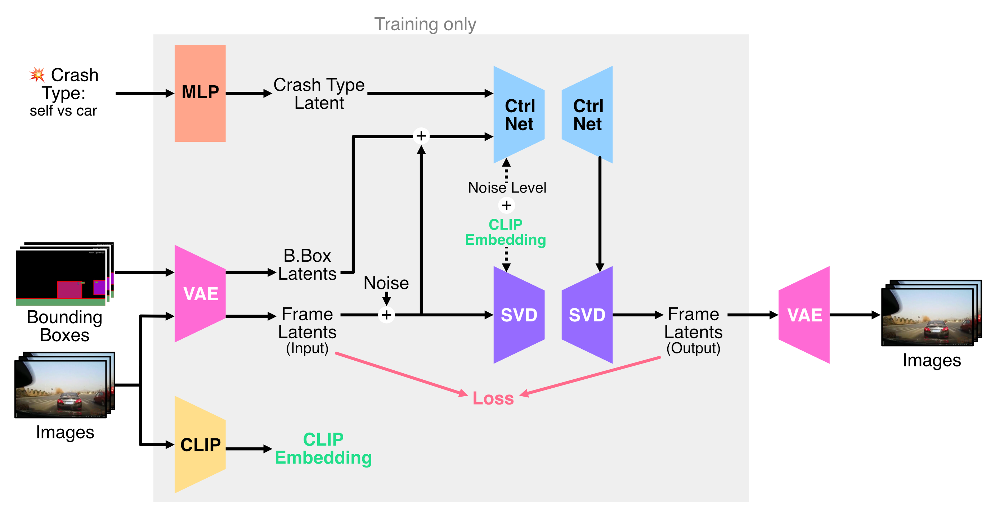

# Ctrl-Crash



## 1. Introduction

<!-- [ALGORITHM] -->

```BibTeX
@article{gosselin2025ctrl,
  title={Ctrl-Crash: Controllable Diffusion for Realistic Car Crashes},
  author={Gosselin, Anthony and Luo, Ge Ya and Lara, Luis and Golemo, Florian and Nowrouzezahrai, Derek and Paull, Liam and Jolicoeur-Martineau, Alexia and Pal, Christopher},
  journal={arXiv preprint arXiv:2506.00227},
  year={2025}
}
```

## 2. To install the environment, run the following script:
```shell
bash scripts/install.sh
```

## 3. To download pretrained weights, run the following script:
```shell
bash scripts/download_weights.sh
```

## 4. To process the dataset, run the following script:
```shell
bash scripts/process_dataset.sh
```

## 5. To train and test the model for the Russia Crash dataset, run the following scripts:
```shell
bash scripts/train.sh
bash scripts/test.sh
```

## 6. Acknowledgement
* [AnthonyGosselin/Ctrl-Crash](https://github.com/AnthonyGosselin/Ctrl-Crash)
