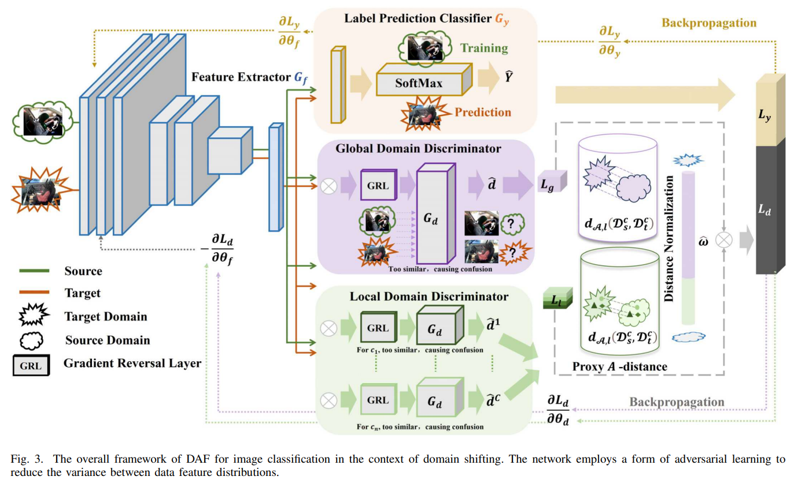

# DAF



## 1. Introduction

<!-- [ALGORITHM] -->

```BibTeX
@article{guo2025dynamic,
  title={A Dynamic Multi-Level Feature Alignment Method for Domain Adaptive Driver Distraction Detection},
  author={Guo, Zizheng and Liu, Qing and Li, Guofa and Luo, Xiyuan and Wang, Guanglei and Olaverri-Monreal, Cristina},
  journal={IEEE Transactions on Intelligent Transportation Systems},
  volume={27},
  number={1},
  pages={1279--1294},
  year={2025},
  publisher={IEEE}
}
```

## 2. To process the dataset, run the following script:
```shell
bash scripts/process_dataset.sh
```

## 3. To train and test the model, run the following scripts:
```shell
bash scripts/train.sh
bash scripts/test.sh
```

## 4. Acknowledgement
* [halahalaliu/DAF](https://github.com/halahalaliu/DAF)
