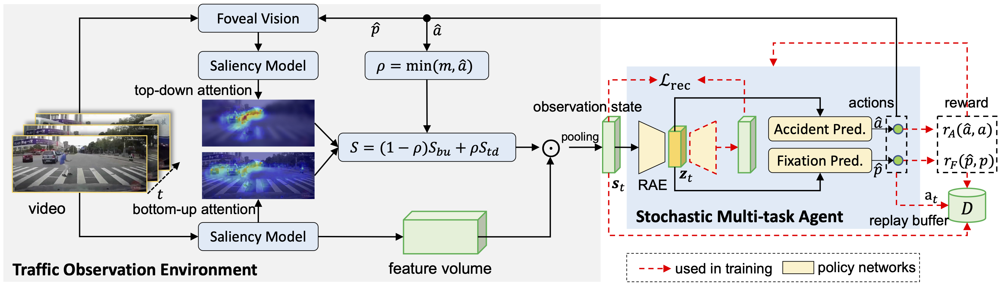

# DRIVE



## 1. Introduction

<!-- [ALGORITHM] -->

```BibTeX
@inproceedings{BaoICCV2021DRIVE,
  author = "Bao, Wentao and Yu, Qi and Kong, Yu",
  title = "Deep Reinforced Accident Anticipation with Visual Explanation",
  booktitle = "International Conference on Computer Vision (ICCV)",
  year = "2021"
}
```

## 2. To install the environment, run the following script:
```shell
bash scripts/install.sh
```

## 3. To train and test the model for the DADA2000 dataset, run the following scripts:
```shell
bash scripts/train_dada.sh
bash scripts/test_dada.sh
```

## 4. Acknowledgement
* [Cogito2012/DRIVE](https://github.com/Cogito2012/DRIVE)
