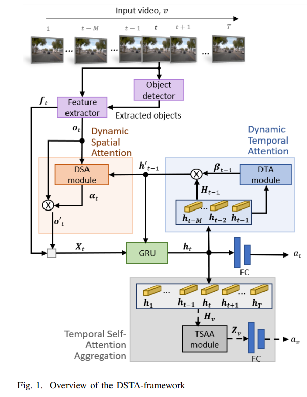

# DSTA



## 1. Introduction

<!-- [ALGORITHM] -->

```BibTeX
@article{karim2022dynamic,
  title={A dynamic spatial-temporal attention network for early anticipation of traffic accidents},
  author={Karim, Muhammad Monjurul and Li, Yu and Qin, Ruwen and Yin, Zhaozheng},
  journal={IEEE Transactions on Intelligent Transportation Systems},
  volume={23},
  number={7},
  pages={9590--9600},
  year={2022},
  publisher={IEEE}
}
```

## 2. To train, test and demo the model for the CCD dataset, run the following scripts:
```shell
bash scripts/train_crash.sh
bash scripts/test_crash.sh
bash scripts/demo_crash.sh
```

## 3. To train, test and demo the model for the DAD dataset, run the following scripts:
```shell
bash scripts/train_dad.sh
bash scripts/test_dad.sh
bash scripts/demo_dad.sh
```

## 4. Acknowledgement
* [monjurulkarim/DSTA](https://github.com/monjurulkarim/DSTA)
