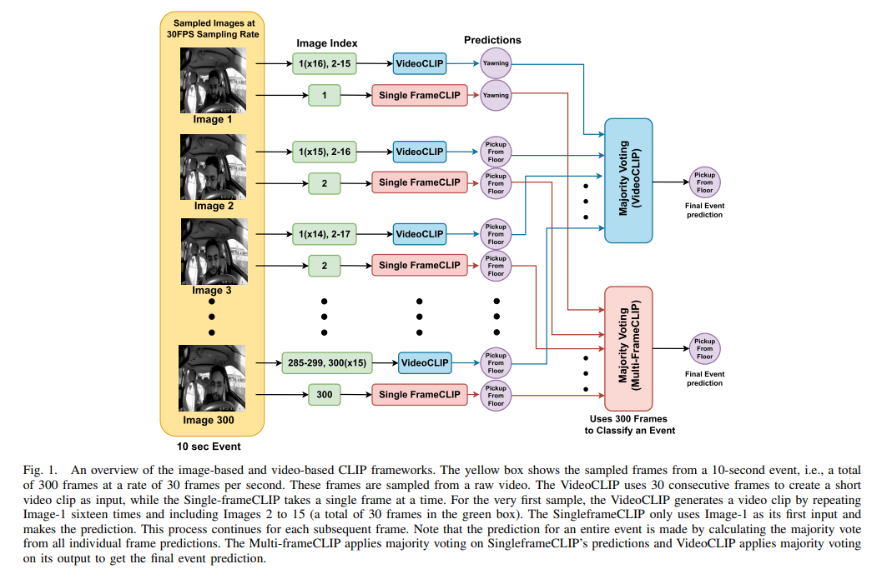

# DriveCLIP



## 1. Introduction

<!-- [ALGORITHM] -->

```BibTeX
@article{hasan2024vision,
  title={Vision-language models can identify distracted driver behavior from naturalistic videos},
  author={Hasan, Md Zahid and Chen, Jiajing and Wang, Jiyang and Rahman, Mohammed Shaiqur and Joshi, Ameya and Velipasalar, Senem and Hegde, Chinmay and Sharma, Anuj and Sarkar, Soumik},
  journal={IEEE Transactions on Intelligent Transportation Systems},
  volume={25},
  number={9},
  pages={11602--11616},
  year={2024},
  publisher={IEEE}
}
```

## 2. To test the model for a video, run the following script:
```shell
bash scripts/test.sh
```

## 3. Acknowledgement
* [zahid-isu/DriveCLIP](https://github.com/zahid-isu/DriveCLIP)
