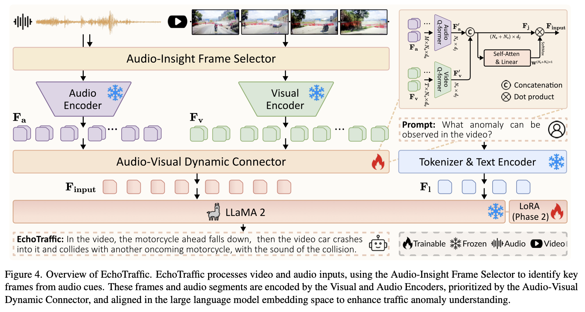

# EchoTraffic



## 1. Introduction

<!-- [ALGORITHM] -->

```BibTeX
@InProceedings{Xing_2025_CVPR,
    author    = {Xing, Zhenghao and Chen, Hao and Xie, Binzhu and Xu, Jiaqi and Guo, Ziyu and Xu, Xuemiao and Hao, Jianye and Fu, Chi-Wing and Hu, Xiaowei and Heng, Pheng-Ann},
    title     = {EchoTraffic: Enhancing Traffic Anomaly Understanding with Audio-Visual Insights},
    booktitle = {Proceedings of the IEEE/CVF Conference on Computer Vision and Pattern Recognition (CVPR)},
    month     = {June},
    year      = {2025},
    pages     = {19098-19108}
}
```

## 2. To download the dataset, run the following script:
```shell
bash scripts/download_dataset.sh
```

## 3. To download the weight, run the following script:
```shell
bash scripts/download_weight.sh
```

## 4. To train and test the model for the AV-TAU dataset, run the following scripts:
```shell
bash scripts/train.sh
bash scripts/test.sh
```

## 5. Acknowledgement
* [HarryHsing/EchoTraffic](https://github.com/HarryHsing/EchoTraffic)
