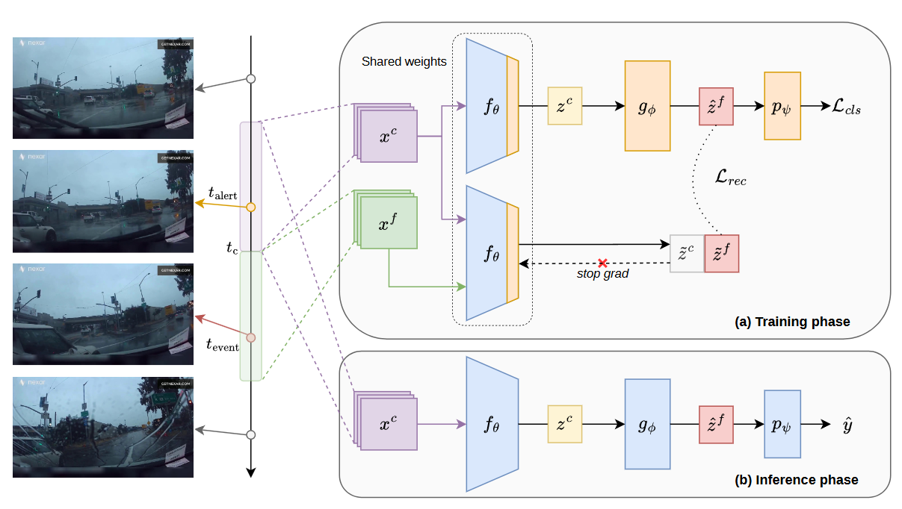

# FLaRA



## 1. Introduction

<!-- [ALGORITHM] -->

```BibTeX
@article{caselli2026flara,
  title={FLaRA: Predicting Future Latent Representations for Accident Anticipation},
  author={Caselli, Lorenzo and Trinci, Tomaso and Bianconcini, Tommaso and Magistri, Simone and Taccari, Leonardo and Sambo, Francesco and Bagdanov, Andrew D},
  journal={arXiv preprint arXiv:2606.14380},
  year={2026}
}
```

## 2. To install the environment, run the following script:
```shell
bash scripts/install.sh
```

## 3. To process the dataset, run the following script:
```shell
bash scripts/process_dataset.sh
```

## 4. To train and test the model, run the following scripts:
```shell
bash scripts/train.sh
bash scripts/test.sh
```

## 5. Acknowledgement
* [LoreCase073/FLaRA)](https://github.com/LoreCase073/FLaRA)
