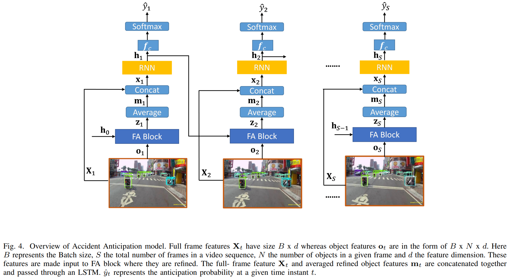

# GFA



## 1. Introduction

<!-- [ALGORITHM] -->

```BibTeX
@inproceedings{chan2016anticipating,
  title={Anticipating accidents in dashcam videos},
  author={Chan, Fu-Hsiang and Chen, Yu-Ting and Xiang, Yu and Sun, Min},
  booktitle={Asian Conference on Computer Vision},
  pages={136--153},
  year={2016},
  organization={Springer}
}
```

## 2. To process the dataset, run the following script:
```shell
bash scripts/process_dataset.sh
```

## 3. To train and test the model for the DAD dataset, run the following script:
```shell
bash scripts/train.sh
```

## 4. Acknowledgement
* [Mishalfatima/Global-Feature-Aggregation-for-Accident-Anticipation](https://github.com/Mishalfatima/Global-Feature-Aggregation-for-Accident-Anticipation)
