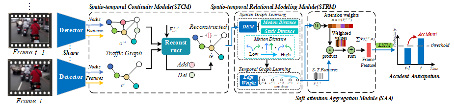

# GSC



## 1. Introduction

<!-- [ALGORITHM] -->

```BibTeX
@article{wang2023gsc,
  title={GSC: A graph and spatio-temporal continuity based framework for accident anticipation},
  author={Wang, Tianhang and Chen, Kai and Chen, Guang and Li, Bin and Li, Zhijun and Liu, Zhengfa and Jiang, Changjun},
  journal={IEEE Transactions on Intelligent Vehicles},
  volume={9},
  number={1},
  pages={2249--2261},
  year={2023},
  publisher={IEEE}
}
```

## 2. To install the environment, run the following script:
```shell
bash scripts/install.sh
```

## 3. To train and test the model for the MASKER_MD dataset, run the following scripts:
```shell
bash scripts/train_masker.sh
bash scripts/test_masker.sh
```

## 4. Acknowledgement
* [ispc-lab/GSC](https://github.com/ispc-lab/GSC)
