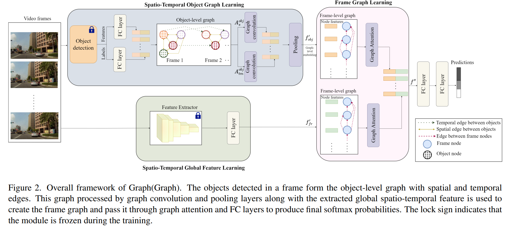

# Graph-Graph



## 1. Introduction

<!-- [ALGORITHM] -->

```BibTeX
@inproceedings{thakur2024graph,
  title={Graph (Graph): A Nested Graph-Based Framework for Early Accident Anticipation},
  author={Thakur, Nupur and Gouripeddi, PrasanthSai and Li, Baoxin},
  booktitle={Proceedings of the IEEE/CVF Winter Conference on Applications of Computer Vision},
  pages={7533--7541},
  year={2024}
}
```

## 2. To train and test the model for the DAD dataset, run the following scripts:
```shell
bash scripts/train_dad.sh
bash scripts/test_dad.sh
```

## 3. Acknowledgement
* [thakurnupur/Graph-Graph](https://github.com/thakurnupur/Graph-Graph)
