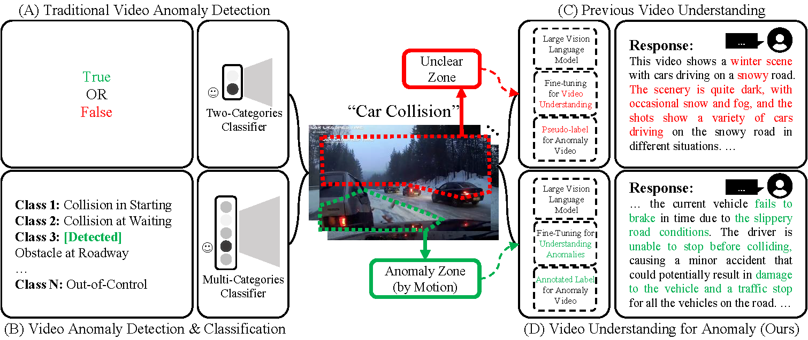

# Hawk



## 1. Introduction

<!-- [ALGORITHM] -->

```BibTeX
@inproceedings{atang2024hawk,
  title = {Hawk: Learning to Understand Open-World Video Anomalies},
  author = {Tang, Jiaqi and Lu, Hao and Wu, Ruizheng and Xu, Xiaogang and Ma, Ke and Fang, Cheng and Guo, Bin and Lu, Jiangbo and Chen, Qifeng and Chen, Ying-Cong},
  year = {2024},
  booktitle = {Neural Information Processing Systems (NeurIPS)}
}
```

## 2. To install the environment, run the following script:
```shell
bash scripts/install.sh
```

## 3. To download the dataset, run the following script:
```shell
bash scripts/download_dataset.sh
```

## 4. To download pretrained weights, run the following script:
```shell
bash scripts/download_weights.sh
```

## 5. To train, test, and demo the model for the DoTA dataset, run the following scripts:
```shell
bash scripts/train_dota.sh
bash scripts/demo.sh
```

## 6. Acknowledgement
* [jqtangust/hawk](https://github.com/jqtangust/hawk)
