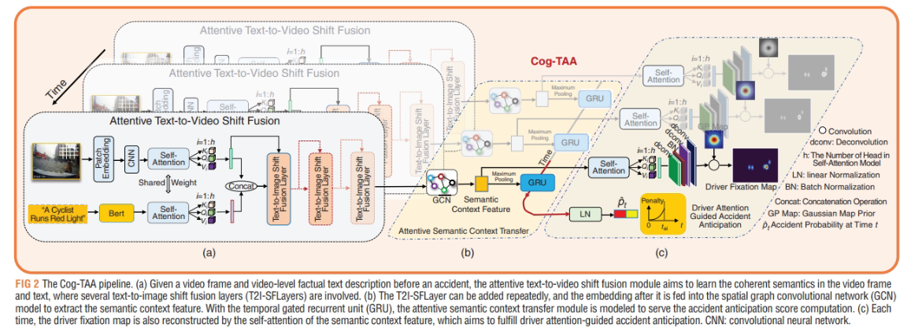

# LOTVS-CAAD



## 1. Introduction

<!-- [ALGORITHM] -->

```BibTeX
@article{li2024cognitive,
  title={Cognitive traffic accident anticipation},
  author={Li, Lei-Lei and Fang, Jianwu and Xue, Jianru},
  journal={IEEE Intelligent Transportation Systems Magazine},
  volume={16},
  number={5},
  pages={17--32},
  year={2024},
  publisher={IEEE}
}
```

## 2. To train and test the model for the DADA-1000 dataset, run the following scripts:
```shell
bash scripts/train_dada.sh
bash scripts/test_dada.sh
```

## 3. Acknowledgement
* [JWFanggit/LOTVS-CAAD](https://github.com/JWFanggit/LOTVS-CAAD)
