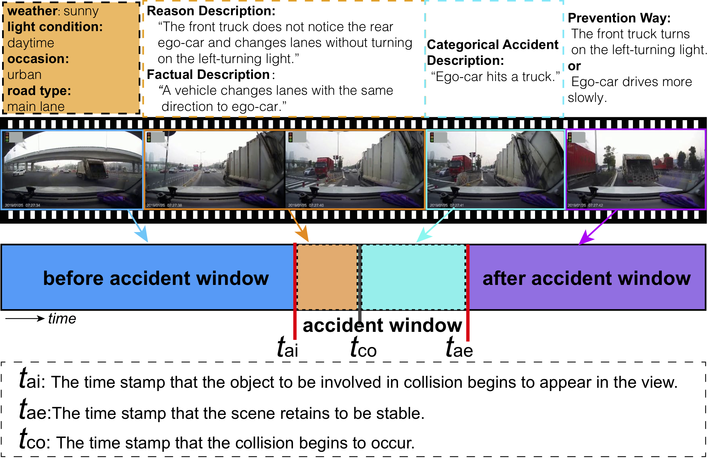

# LOTVS-CAP



## 1. Introduction

<!-- [ALGORITHM] -->

```BibTeX
@article{DBLP:journals/corr/abs-2212-09381,
  author    = {Jianwu Fang and
               Lei{-}Lei Li and
               Kuan Yang and
               Zhedong Zheng and
               Jianru Xue and
               Tat{-}Seng Chua},
  title     = {Cognitive Accident Prediction in Driving Scenes: {A} Multimodality
               Benchmark},
  journal   = {CoRR},
  volume    = {abs/2212.09381},
  year      = {2022},
}
```

## 2. To train and test the model for the DADA-1000 dataset, run the following scripts:
```shell
bash scripts/train_dada.sh
bash scripts/test_dada.sh
```

## 3. Acknowledgement
* [jwfanggit/lotvs-cap](https://github.com/jwfanggit/lotvs-cap)
