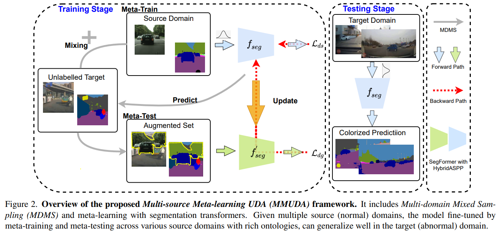

# MMUDA



## 1. Introduction

<!-- [ALGORITHM] -->

```BibTeX
@inproceedings{luo2022towards,
  title={Towards Robust Semantic Segmentation of Accident Scenes via Multi-Source Mixed Sampling and Meta-Learning},
  author={Luo, Xinyu and Zhang, Jiaming and Yang, Kailun and Roitberg, Alina and Peng, Kunyu and Stiefelhagen, Rainer},
  booktitle={2022 IEEE/CVF Conference on Computer Vision and Pattern Recognition Workshops (CVPRW)},
  year={2022}
}
```

## 2. To install the environment, run the following script:
```shell
bash scripts/install.sh
```

## 3. To train and test the model for Cityscapes and DADA-Seg datasets, run the following scripts:
```shell
bash scripts/trai.sh
bash scripts/test.sh
```

## 4. Acknowledgement
* [xinyu-laura/mmuda](https://github.com/xinyu-laura/mmuda)
