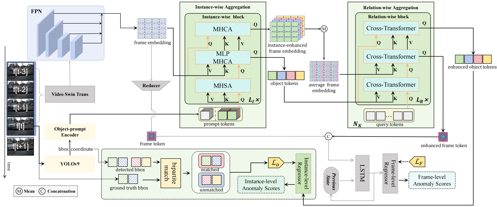

# PromptTAD



## 1. Introduction

<!-- [ALGORITHM] -->

```BibTeX
@ARTICLE{11008816,
  author={Qiu, Hao and Yang, Xiaobo and Gong, Xiaojin},
  journal={IEEE Robotics and Automation Letters}, 
  title={PromptTAD: Object-Prompt Enhanced Traffic Anomaly Detection}, 
  year={2025},
  volume={},
  number={},
  pages={1-8},
  keywords={Videos;Anomaly detection;Feature extraction;Vehicle dynamics;Object recognition;Long short term memory;Location awareness;Interference;Visualization;Transformers;Deep Learning for Visual Perception;Object Detection;Segmentation and Categorization},
  doi={10.1109/LRA.2025.3572428}
}
```

## 2. To download the pretrained weight, run the following script:
```shell
bash scripts/download_weight.sh
```

## 3. To process the dataset, run the following script:
```shell
bash scripts/process_dataset.sh
```

## 4. To train and test the model for the DoTA dataset, run the following scripts:
```shell
bash scripts/train_dota.sh
bash scripts/test_dota.sh
```

## 5. Acknowledgement
* [Smartpearkorl/PromptTAD](https://github.com/Smartpearkorl/PromptTAD)
