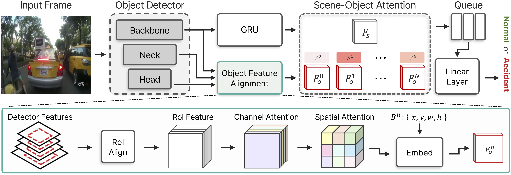

# RARE



## 1. Introduction

<!-- [ALGORITHM] -->

```BibTeX
@misc{song2025realtimetrafficaccidentanticipation,
      title={Real-time Traffic Accident Anticipation with Feature Reuse}, 
      author={Inpyo Song and Jangwon Lee},
      year={2025},
      eprint={2505.17449},
      archivePrefix={arXiv},
      primaryClass={cs.CV},
      url={https://arxiv.org/abs/2505.17449}, 
}
```

## 2. To process the dataset, run the following script:
```shell
bash scripts/process_dataset.sh
```

## 3. To train, test, and demo the model for the DAD dataset, run the following scripts:
```shell
bash scripts/train_dad.sh
bash scripts/test_dad.sh
bash scripts/demo_dad.sh
```

## 4. Acknowledgement
* [Songinpyo/RARE-ICIP2025](https://github.com/Songinpyo/RARE-ICIP2025)
