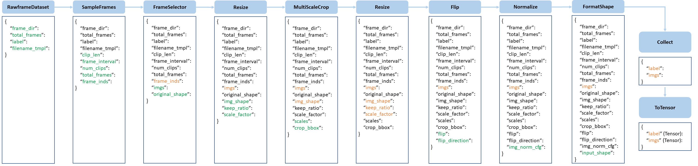

# RiskProp



## 1. Introduction

<!-- [ALGORITHM] -->

```BibTeX
@inproceedings{riskprop2026,
  title     = {RiskProp: Collision-Anchored Self-supervised Temporal Constraints for Early Accident Anticipation},
  author    = {zyy, zth},
  booktitle = {Proceedings of the IEEE/CVF Conference on Computer Vision and Pattern Recognition (CVPR)},
  year      = {2026}
}
```

## 2. To install the environment, run the following script:
```shell
bash scripts/install.sh
```

## 3. To download the dataset, run the following script:
```shell
bash scripts/download_dataset.sh
```

## 4. To process the dataset, run the following script:
```shell
bash scripts/process_dataset.sh
```

## 5. To train and test the model for MM-AU and nexar-collision-prediction datasets, run the following scripts:
```shell
bash scripts/train.sh
bash scripts/test.sh
```

## 6. Acknowledgement
* [xingyueye5/RiskProp](https://github.com/xingyueye5/RiskProp)
