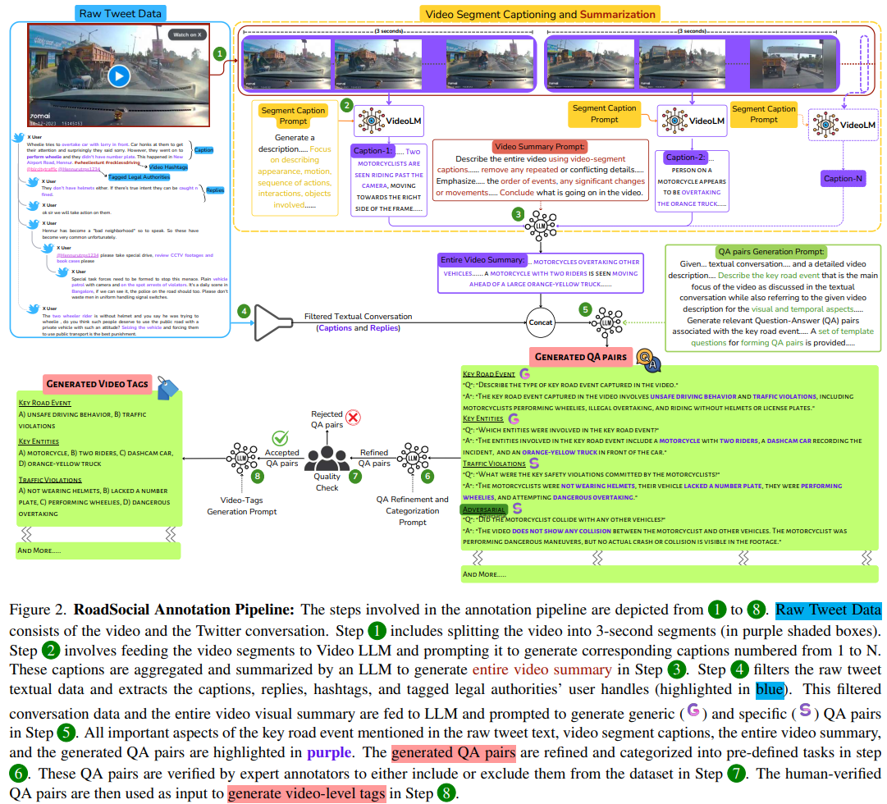

# RoadSocial



## 1. Introduction

<!-- [ALGORITHM] -->

```BibTeX
@inproceedings{parikh2025roadsocial,
  title={RoadSocial: A Diverse VideoQA Dataset and Benchmark for Road Event Understanding from Social Video Narratives},
  author={Parikh, Chirag and Rawat, Deepti and Ghosh, Tathagata and Sarvadevabhatla, Ravi Kiran and others},
  booktitle={Proceedings of the Computer Vision and Pattern Recognition Conference},
  pages={19002--19011},
  year={2025}
}
```

## 2. To install the environment, run the following script:
```shell
bash scripts/install.sh
```

## 3. To download the dataset, run the following script:
```shell
bash scripts/download_dataset.sh
```

## 4. To download the pretrained weight, run the following script:
```shell
bash scripts/download_weight.sh
```

## 5. To test the model for the RoadSocial dataset, run the following script:
```shell
bash scripts/test.sh
```

## 6. Acknowledgement
* [roadsocial/roadsocial](https://github.com/roadsocial/roadsocial)
