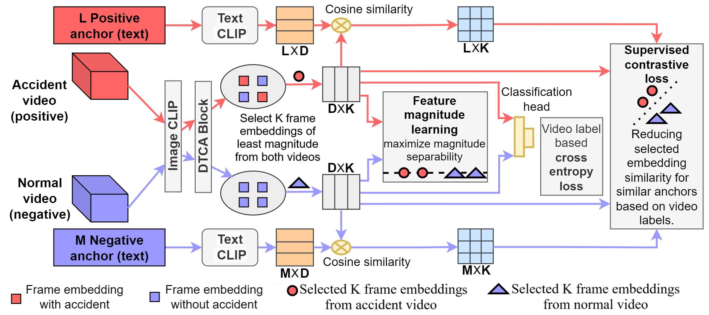

# TIME-VAD



## 1. Introduction

<!-- [ALGORITHM] -->

```BibTeX
@ARTICLE{11295937,
  author={Mishra, Sumit and Mishra, Medhavi and Shyam, Pranjay and Har, Dongsoo},
  journal={IEEE Transactions on Intelligent Transportation Systems}, 
  title={TIME-VAD: Text-Informed Magnitude Enhancement Feature Learning for Vehicle Accident Detection and Anticipation}, 
  year={2025},
  volume={},
  number={},
  pages={1-16},
  doi={10.1109/TITS.2025.3637912}
}
```

## 2. To install the environment, run the following script:
```shell
bash scripts/install.sh
```

## 3. To process the dataset, run the following script:
```shell
bash scripts/process_dataset.sh
```

## 4. To host the server, run the following script:
```shell
bash scripts/host_server.sh
```

## 5. To train and test the model for the DAD dataset, run the following scripts:
```shell
bash scripts/train_dad.sh
bash scripts/test_dad.sh
```

## 6. Acknowledgement
* [sumitmishra209/TIME-VAD](https://github.com/sumitmishra209/TIME-VAD)
