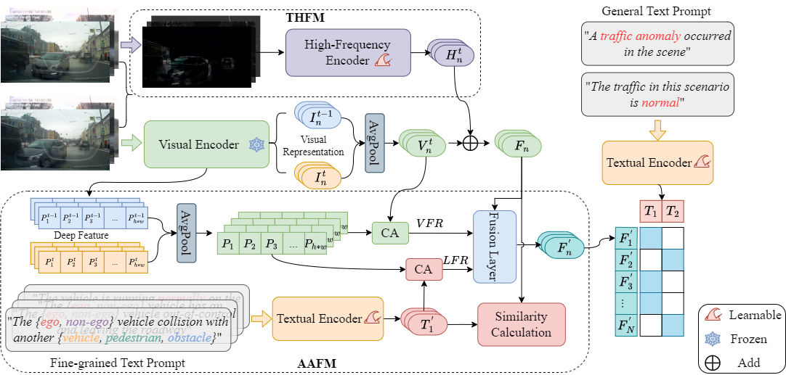

# TTHF



## 1. Introduction

<!-- [ALGORITHM] -->

```BibTeX
@article{10504300,
    title={Text-Driven Traffic Anomaly Detection with Temporal High-Frequency Modeling in Driving Videos},
    author={Rongqin Liang and Yuanman Li and Jiantao Zhou and Xia Li},
    journal={IEEE Transactions on Circuits and Systems for Video Technology},
    year={2024},
    doi={10.1109/TCSVT.2024.3390173}
}
```

## 2. To install the environment, run the following script:
```shell
bash scripts/install.sh
```

## 3. To extract the dataset, run the following script:
```shell
bash scripts/extract_dataset.sh
```

## 4. To process the dataset, run the following script:
```shell
bash scripts/process_dataset.sh
```

## 5. To train and test the model for DoTA and DADA-2000 datasets, run the following scripts:
```shell
bash scripts/train.sh
bash scripts/test.sh
```

## 6. Acknowledgement
* [Blessinglrq/TTHF](https://github.com/Blessinglrq/TTHF)
