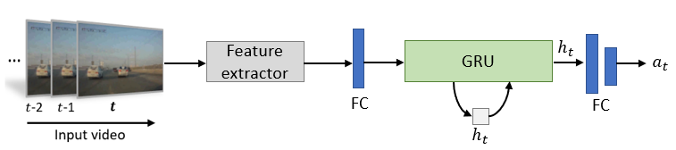

# Baseline GRU



## 1. To train, test and demo the model for the DAD dataset, run the following scripts:
```shell
bash scripts/main.py
bash scripts/demo.py
```

## 2. Acknowledgement
* [monjurulkarim/simple-accident-prediction](https://github.com/monjurulkarim/simple-accident-prediction)
