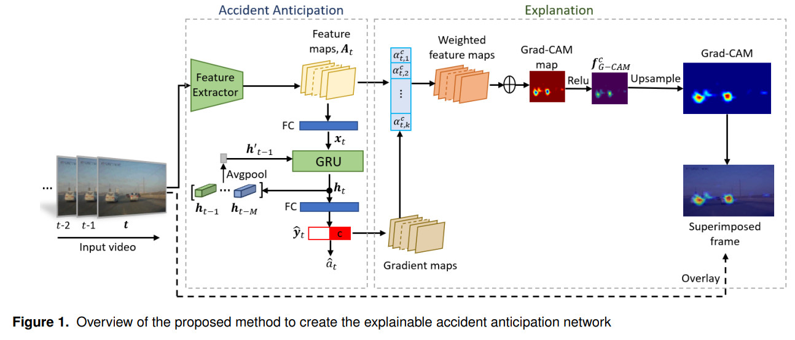

# XAI-Accident



## 1. Introduction

<!-- [ALGORITHM] -->

```BibTeX
@article{monjurul2021towards,
  title={Towards explainable artificial intelligence (XAI) for early anticipation of traffic accidents},
  author={Monjurul Karim, Muhammad and Li, Yu and Qin, Ruwen},
  journal={arXiv e-prints},
  pages={arXiv--2108},
  year={2021}
}
```

## 2. To train, test and demo the model for the CCD dataset, run the following scripts:
```shell
bash scripts/main.py
bash scripts/demo.py
```

## 3. Acknowledgement
* [monjurulkarim/xai-accident](https://github.com/monjurulkarim/xai-accident)
