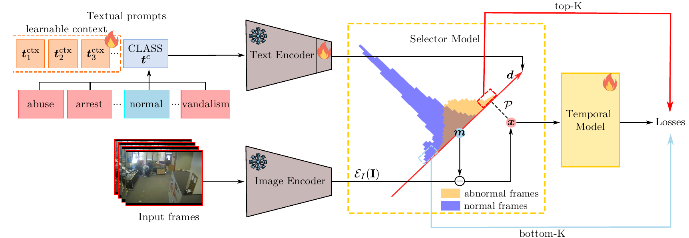

# AnomalyCLIP



## 1. Introduction

<!-- [ALGORITHM] -->

```BibTeX
@article{zanella2024delving,
  title={Delving into clip latent space for video anomaly recognition},
  author={Zanella, Luca and Liberatori, Benedetta and Menapace, Willi and Poiesi, Fabio and Wang, Yiming and Ricci, Elisa},
  journal={Computer Vision and Image Understanding},
  volume={249},
  pages={104163},
  year={2024},
  publisher={Elsevier}
}
```

## 2. To train and test the model for ShanghaiTech, UCF-Crime, and XD-Violence datasets, please run the following scripts:
```shell
bash scripts/train_shanghai.sh
bash scripts/train_ucf.sh
bash scripts/train_xd.sh
bash scripts/test_shanghai.sh
bash scripts/test_ucf.sh
bash scripts/test_xd.sh
```

## 3. Acknowledgement
* [lucazanella/AnomalyCLIP](https://github.com/lucazanella/AnomalyCLIP)
