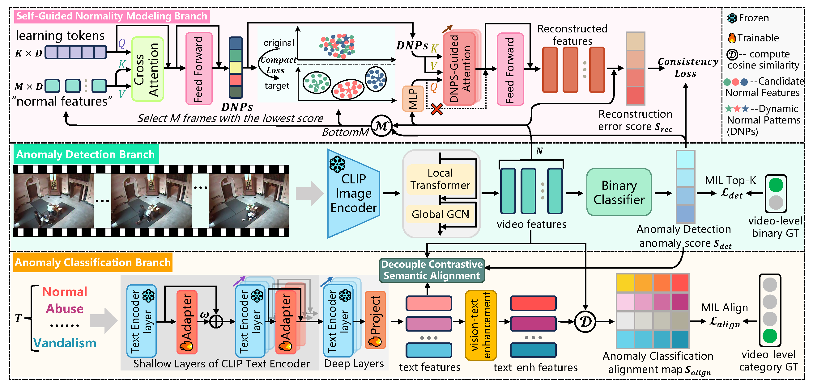

# DSANet



## 1. Introduction

<!-- [ALGORITHM] -->

```BibTeX
@misc{yin2025learningtellapartweakly,
      title={Learning to Tell Apart: Weakly Supervised Video Anomaly Detection via Disentangled Semantic Alignment}, 
      author={Wenti Yin and Huaxin Zhang and Xiang Wang and Yuqing Lu and Yicheng Zhang and Bingquan Gong and Jialong Zuo and Li Yu and Changxin Gao and Nong Sang},
      year={2025},
      eprint={2511.10334},
      archivePrefix={arXiv},
      primaryClass={cs.CV},
      url={https://arxiv.org/abs/2511.10334}, 
}
```

## 2. To process the dataset, please run the following script:
```shell
bash scripts/process_dataset.sh
```

## 3. To train and test the model for UCF-Crime and XD-Violence datasets, please run the following scripts:
```shell
bash scripts/train_ucf.sh
bash scripts/train_xd.sh
bash scripts/test_ucf.sh
bash scripts/test_xd.sh
```

## 4. Acknowledgement
* [lessiYin/DSANet](https://github.com/lessiYin/DSANet)
