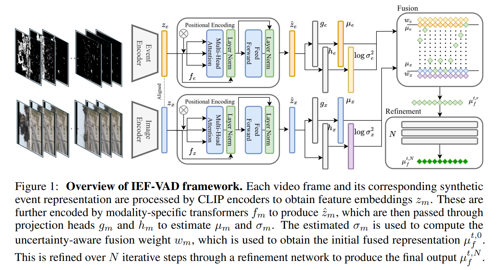

# IEF-VAD



## 1. Introduction

<!-- [ALGORITHM] -->

```BibTeX
@article{jeong2025uncertainty,
  title={Uncertainty-Weighted Image-Event Multimodal Fusion for Video Anomaly Detection},
  author={Jeong, Sungheon and Park, Jihong and Imani, Mohsen},
  journal={arXiv preprint arXiv:2505.02393},
  year={2025}
}
```

## 2. To download the pretrained weight, please run the following script:
```shell
bash scripts/download_weight.sh
```

## 3. To process the dataset, please run the following scripts:
```shell
bash scripts/process_dataset.sh
bash scripts/create_list.sh
```

## 4. To train and test the model for the UCF-Crime dataset, please run the following scripts:
```shell
bash scripts/train.sh
bash scripts/test.sh
```

## 5. Acknowledgement
* [EavnJeong/IEF-VAD](https://github.com/EavnJeong/IEF-VAD)
