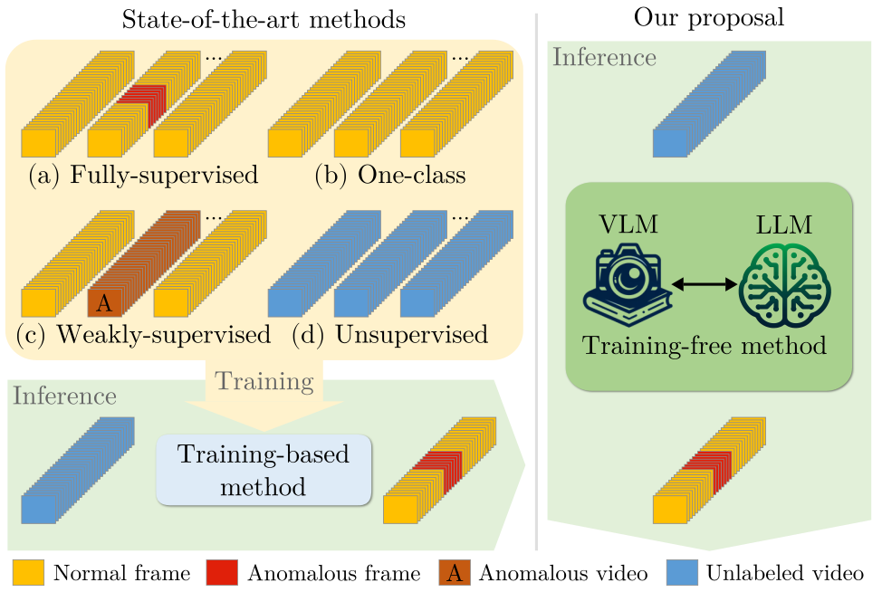

# LAVAD



## 1. Introduction

<!-- [ALGORITHM] -->

```BibTeX
@inproceedings{zanella2024harnessing,
  title={Harnessing Large Language Models for Training-free Video Anomaly Detection},
  author={Zanella, Luca and Menapace, Willi and Mancini, Massimiliano and Wang, Yiming and Ricci, Elisa},
  booktitle={Proceedings of the IEEE/CVF Conference on Computer Vision and Pattern Recognition},
  pages={18527--18536},
  year={2024}
}
```

## 2. To download the pretrained weight, please run the following script:
```shell
bash scripts/download_weight.sh
```

## 3. To train and test the model for the UCF-Crime dataset, please run the following script:
```shell
bash scripts/train_ucf.sh
bash scripts/test_ucf.sh
```

## 4. Acknowledgement
* [lucazanella/lavad](https://github.com/lucazanella/lavad)
