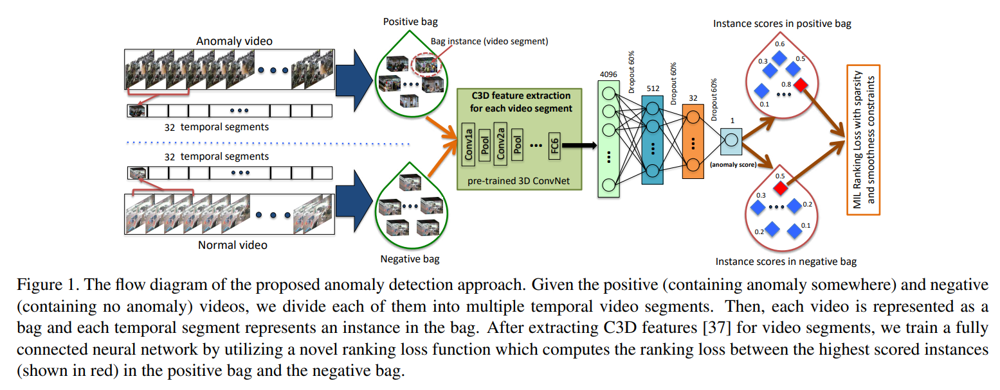

# MIL



## 1. Introduction

<!-- [ALGORITHM] -->

```BibTeX
@inproceedings{sultani2018real,
  title={Real-world anomaly detection in surveillance videos},
  author={Sultani, Waqas and Chen, Chen and Shah, Mubarak},
  booktitle={Proceedings of the IEEE conference on computer vision and pattern recognition},
  pages={6479--6488},
  year={2018}
}
```

## 2. To train, test, and demo the model for the UCF-Crime dataset, please run the following scripts:
```shell
bash scripts/train.sh
bash scripts/extract_frame.sh
bash scripts/demo.sh
```

## 3. Acknowledgement
* [seominseok0429/Real-world-Anomaly-Detection-in-Surveillance-Videos-pytorch](https://github.com/seominseok0429/Real-world-Anomaly-Detection-in-Surveillance-Videos-pytorch)
