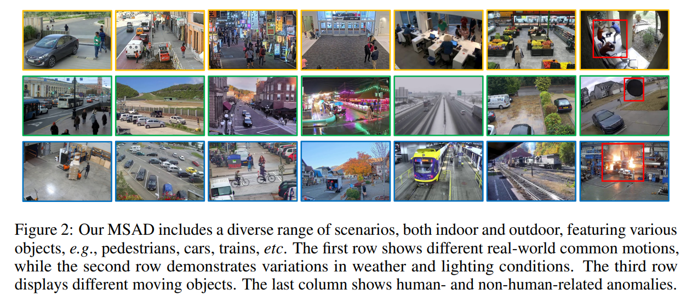

# MSAD



## 1. Introduction

<!-- [ALGORITHM] -->

```BibTeX
@inproceedings{msad2024,
    title = {Advancing Video Anomaly Detection: A Concise Review and a New Dataset},
    author = {Liyun Zhu and Lei Wang and Arjun Raj and Tom Gedeon and Chen Chen},
    booktitle = {The Thirty-eight Conference on Neural Information Processing Systems Datasets and Benchmarks Track},
    year = {2024}
}
```

## 2. To process the dataset, please run the following script:
```shell
bash scripts/process_dataset.sh
```

## 3. To train and test the model for the MSAD dataset, please run the following scripts:
```shell
bash scripts/train.sh
bash scripts/test.sh
```

## 3. Acknowledgement
* [Tom-roujiang/MSAD](https://github.com/Tom-roujiang/MSAD)
