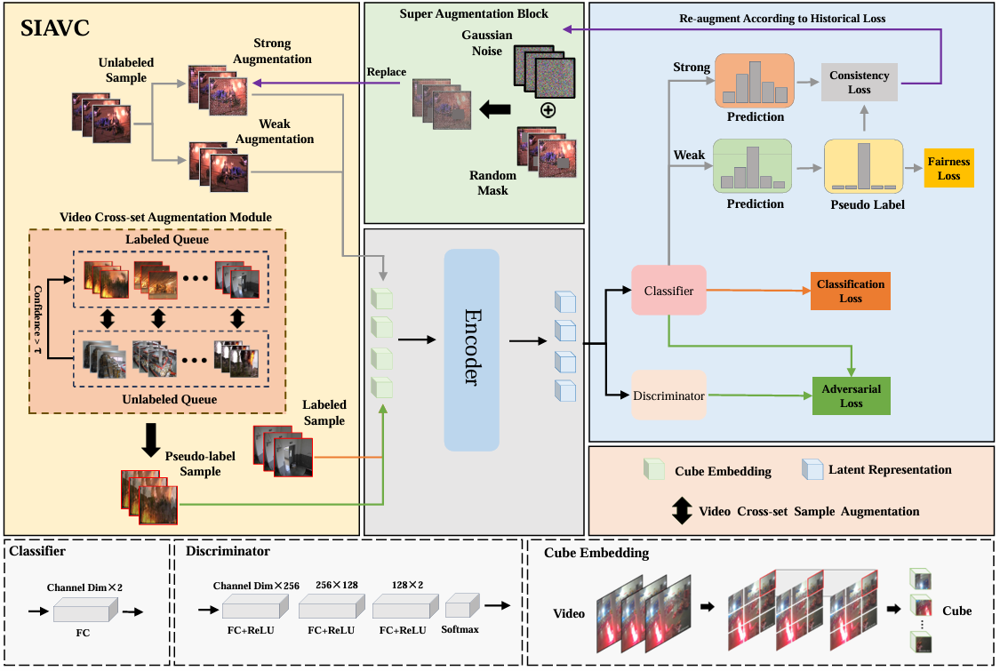

# SIAVC



## 1. Introduction

<!-- [ALGORITHM] -->

```BibTeX
@ARTICLE{10741535,
  author={Li, Zuoyong and Lin, Qinghua and Fan, Haoyi and Zhao, Tiesong and Zhang, David},
  journal={IEEE Transactions on Circuits and Systems for Video Technology}, 
  title={SIAVC: Semi-Supervised Framework for Industrial Accident Video Classification}, 
  year={2025},
  volume={35},
  number={3},
  pages={2603-2615},
  doi={10.1109/TCSVT.2024.3490597}}
```

## 2. To train and test the model for the ECA9 dataset, please run the following script:
```shell
bash scripts/train.sh
```

## 3. Acknowledgement
* [alchemyemperor/siavc](https://github.com/alchemyemperor/siavc)
