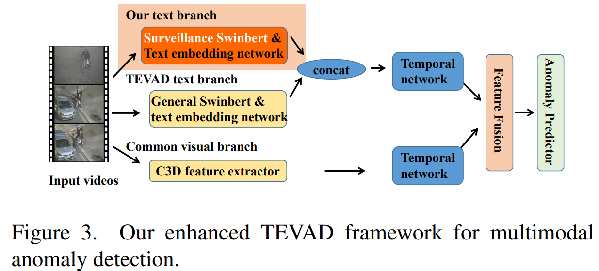

# UCA



## 1. Introduction

<!-- [ALGORITHM] -->

```BibTeX
@misc{yuan2023surveillance,
      title={Towards Surveillance Video-and-Language Understanding: New Dataset, Baselines, and Challenges}, 
      author={Tongtong Yuan and Xuange Zhang and Kun Liu and Bo Liu and Chen Chen and Jian Jin and Zhenzhen Jiao},
      year={2023},
      eprint={2309.13925},
      archivePrefix={arXiv},
      primaryClass={cs.CV}
}
```

## 2. Acknowledgement
* [Xuange923/Surveillance-Video-Understanding](https://github.com/Xuange923/Surveillance-Video-Understanding)
