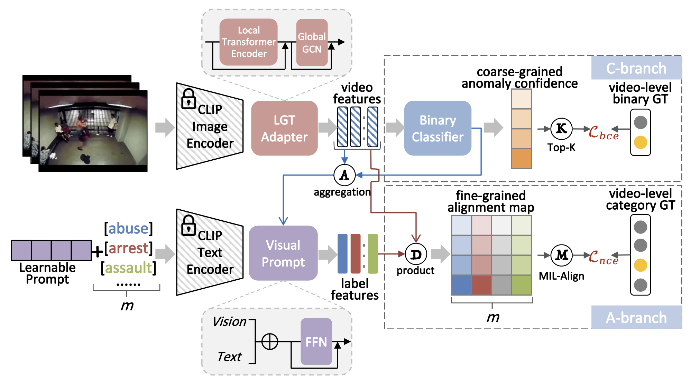

# VadCLIP



## 1. Introduction

<!-- [ALGORITHM] -->

```BibTeX
@article{wu2023vadclip,
  title={Vadclip: Adapting vision-language models for weakly supervised video anomaly detection},
  author={Wu, Peng and Zhou, Xuerong and Pang, Guansong and Zhou, Lingru and Yan, Qingsen and Wang, Peng and Zhang, Yanning},
  booktitle={Proceedings of the AAAI Conference on Artificial Intelligence (AAAI)},
  year={2024}
}
```

## 2. To process the dataset, please run the following script:
```shell
bash scripts/process_dataset.sh
```

## 3. To train and test the model for UCF-Crime and XD-Violence datasets, please run the following scripts:
```shell
bash scripts/train.sh
bash scripts/test.sh
```

## 4. Acknowledgement
* [nwpu-zxr/VadCLIP](https://github.com/nwpu-zxr/VadCLIP)
